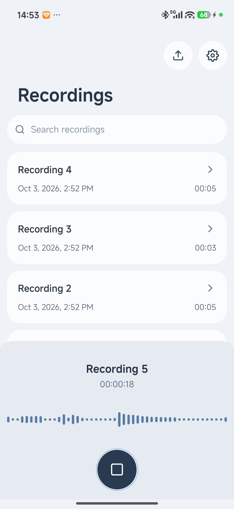
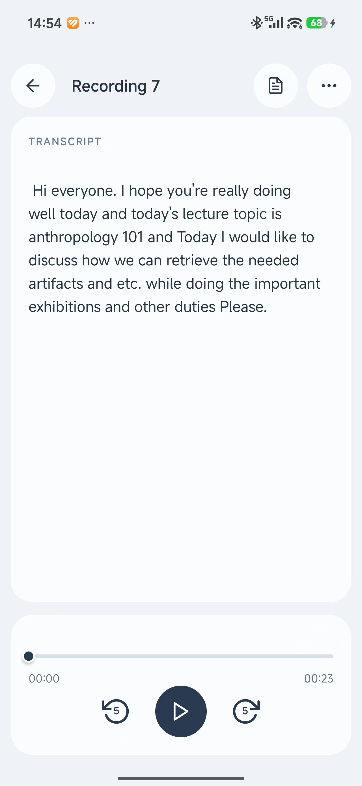
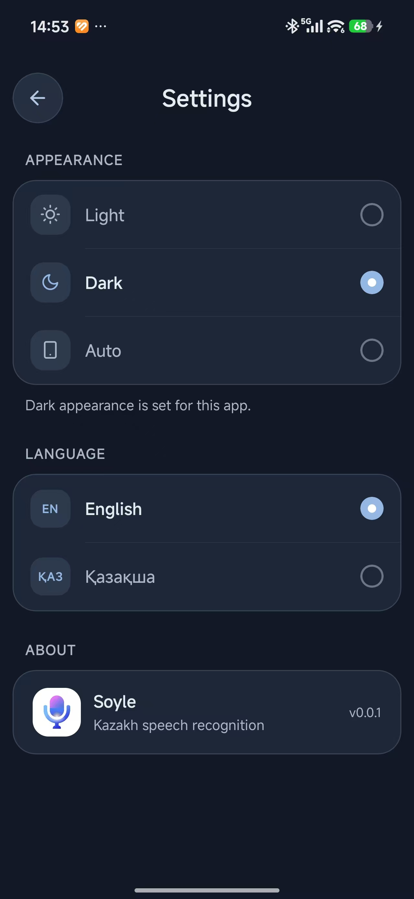

# Soyle

Soyle is a voice recording and transcription app built with React Native and [whisper.cpp](https://github.com/ggerganov/whisper.cpp). Record a note or import an audio file, then transcribe it on your device with a Whisper GGML model.

## What you can do

- Record voice notes and transcribe them.
- Import audio files and transcribe them.
- Play recordings, browse and search your notes, and rename recordings.
- Switch the app between English and Kazakh, and choose light, dark, or system appearance.

## Screenshots

| Recordings                                                       | Playback and transcript                                                      | Settings                                                                |
| ---------------------------------------------------------------- | ---------------------------------------------------------------------------- | ----------------------------------------------------------------------- |
|  |  |  |

## Run the app

You need Node.js 18 or newer, Yarn, and an Android or iOS development environment. iOS builds require macOS and Xcode.

Install dependencies from the repository root, then from the `example` folder:

```sh
# From the repository root
yarn

# Install the example app dependencies
cd example
yarn
cd ..
```

Start Metro from the repository root:

```sh
yarn example start
```

Leave Metro running. In a second terminal at the repository root, launch the app:

```sh
yarn example android
```

For iOS, on macOS, run `yarn example ios` instead. You can also run either platform command without the separate Metro step; React Native will start the packager as needed.

## Use a GGML Whisper model

The example currently bundles `example/assets/ggml-tiny.en.bin`. To use another Whisper model, including a Kazakh model:

1. Download a compatible `.bin` GGML model. Find models for other languages in the [whisper.cpp model collection](https://huggingface.co/ggerganov/whisper.cpp/tree/main), or use the [kunbolsyn Kazakh GGML model](https://huggingface.co/kunbolsyn/whisper-kazakh-ggml/tree/main).
2. Put the downloaded model file in `example/assets/`.
3. In `example/src/App.tsx`, change the model path to match its filename:

   ```ts
   filePath: require('../assets/your-model-file.bin'),
   ```

The model is bundled into the app, so a larger model also makes the app larger.

## Using the library

This repository also contains `whisper.rn`, a React Native binding for whisper.cpp. Install it in your app with:

```sh
yarn add whisper.rn
```

See the [library documentation](docs/) for API details, setup, and examples.

## License

MIT
